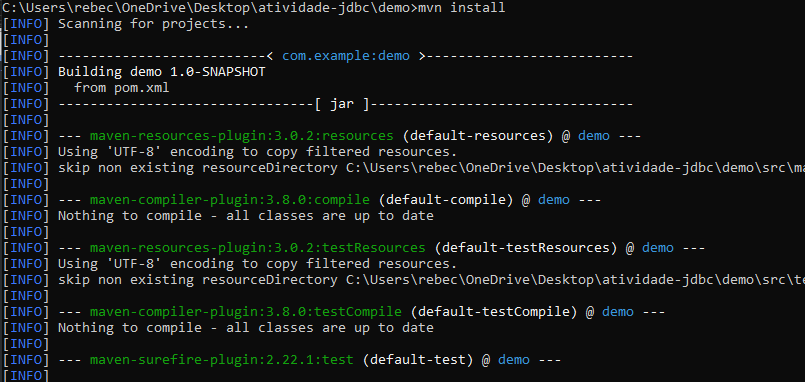
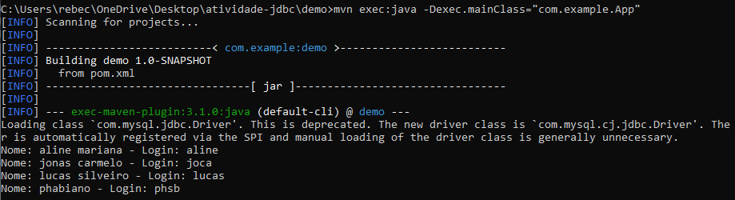

# Atividade de Banco de Dados

Como objetivo da atividade, utilizei JDBC para implementar um programa principal que se conecta ao banco de dados da locadora e executa a consulta "SELECT * FROM cliente". 

## Passo a passo

1. Para realizar a conexão com o banco de dados usando Java, criei um projeto Maven e instalei a dependência no file nomeado como "pom.xml":

``` 
<dependency>
    <groupId>mysql</groupId>
    <artifactId>mysql-connector-java</artifactId>
    <version>8.0.33</version>
</dependency> 
```
Com essa dependência, eu pude me conectar ao JDBC do MySQL.

2. Após isso, compilei o código usando o comando:

```
mvn install
```



3. Por último, basta rodar a classe do projeto com o seguinte comando que ele terá como output o nome e o login dos clientes da locadora.

```
mvn exec:java -Dexec.mainClass="com.example.App"
```




## Para rodar

Para rodar o código, é necessário ter instalado Java e Maven e ter os caminhos das instalações no path das variáveis de ambiente do usuário e do sistema.
